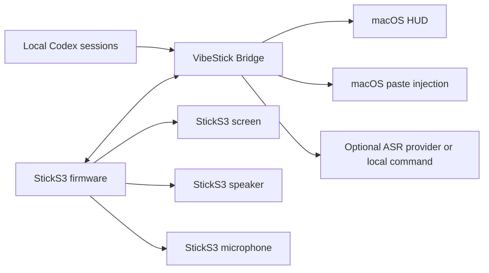

# VibeStick Architecture

VibeStick has two active runtime parts:

1. StickS3 firmware.
2. Local Mac bridge service.

The StickS3 does not call cloud AI services directly. It talks to the Mac bridge
over USB when the data cable is connected and the bridge handshake succeeds,
with HTTP over Wi-Fi as the automatic fallback.



## StickS3 Firmware

Firmware lives in `firmware/sticks3/`.

It owns:

- Screen rendering with LVGL.
- USB runtime connection and Wi-Fi fallback.
- Polling `GET /state`.
- Posting button events to `/event` and `/quota/refresh`.
- Blue front-button push-to-talk recording.
- 16 kHz / 16-bit / mono PCM recording from the StickS3 microphone.
- Uploading PCM to `/recording/audio`.
- Agent status sounds generated as PCM and played through ES8311/I2S speaker output.
- Local battery and USB power display from the StickS3 PMIC.

It does not read account cookies, browser state, API keys, or quota dashboards.

## Mac Bridge

Bridge code lives in `bridge/src/vibe_stick/`.

It owns:

- USB runtime protocol and HTTP fallback API for the StickS3.
- Local Codex status and quota observation from `~/.codex/sessions/**/*.jsonl`.
- Recording session state.
- Optional ASR via local command or Groq API.
- Transcript paste injection into the active macOS app.
- HUD state file updates for recording status.

Bridge state is stored under:

```text
~/Library/Application Support/VibeStick/
```

## Transport

The preferred runtime transport is the ESP32-S3 fixed-function USB Serial/JTAG
channel. The bridge scans the Mac's `/dev/cu.usbmodem*` ports and completes a
VibeStick protocol handshake before the firmware sends state, button, or audio
traffic through USB. The same port remains usable for firmware flashing and
serial logs.

When no USB handshake is active, the firmware uses HTTP over Wi-Fi. The Mac
bridge advertises `_vibestick._tcp.local` through Bonjour, and the StickS3
resolves that service after obtaining a Wi-Fi address. The discovered address
replaces the configured bridge address. The configured address remains only as
a compatibility fallback when Bonjour is unavailable.

After a failed HTTP connection or a new Wi-Fi address, the firmware repeats
service discovery instead of continuing to use a stale Mac address.

BLE is not part of the current mainline transport.

## State Flow

1. The StickS3 polls `GET /state` every 2 seconds.
2. The Bridge builds a local `VibeStickState`.
3. The StickS3 parses Codex status, quota fields, and alert fields.
4. The StickS3 renders the home screen.
5. Alert sounds are triggered only on relevant alert state changes, not on every poll.

## Recording Flow

1. User long-presses the blue front button.
2. Firmware starts StickS3 microphone recording and posts `/recording/start`.
3. Firmware shows a full-screen listening overlay.
4. User releases the button.
5. Firmware stops recording, uploads PCM to `/recording/audio`, then posts `/recording/stop`.
6. Bridge writes a local WAV file, runs ASR, and pastes the transcript when successful.
7. Recording start and stop do not play agent alert sounds.

## Status And Quota

Codex status is inferred from local Codex process/session activity and recent session event payloads. Quota is inferred from `token_count` events containing `rate_limits`. This is a local observation strategy, not an official quota API.

The StickS3 provider surface is limited to the providers explicitly compiled into the firmware.

## v0.1.1 Limits

- No packaged Mac App.
- No signed firmware release artifact.
- No general device abstraction beyond StickS3.
- No official provider API for quota.
- No BLE runtime transport.
